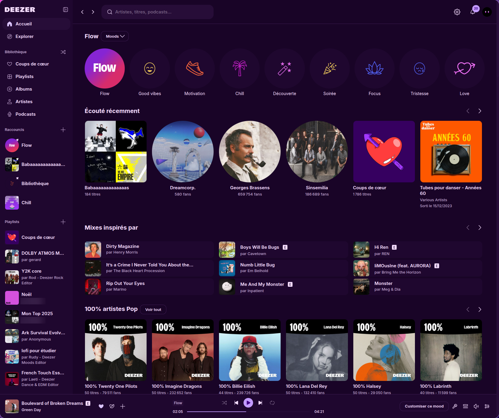
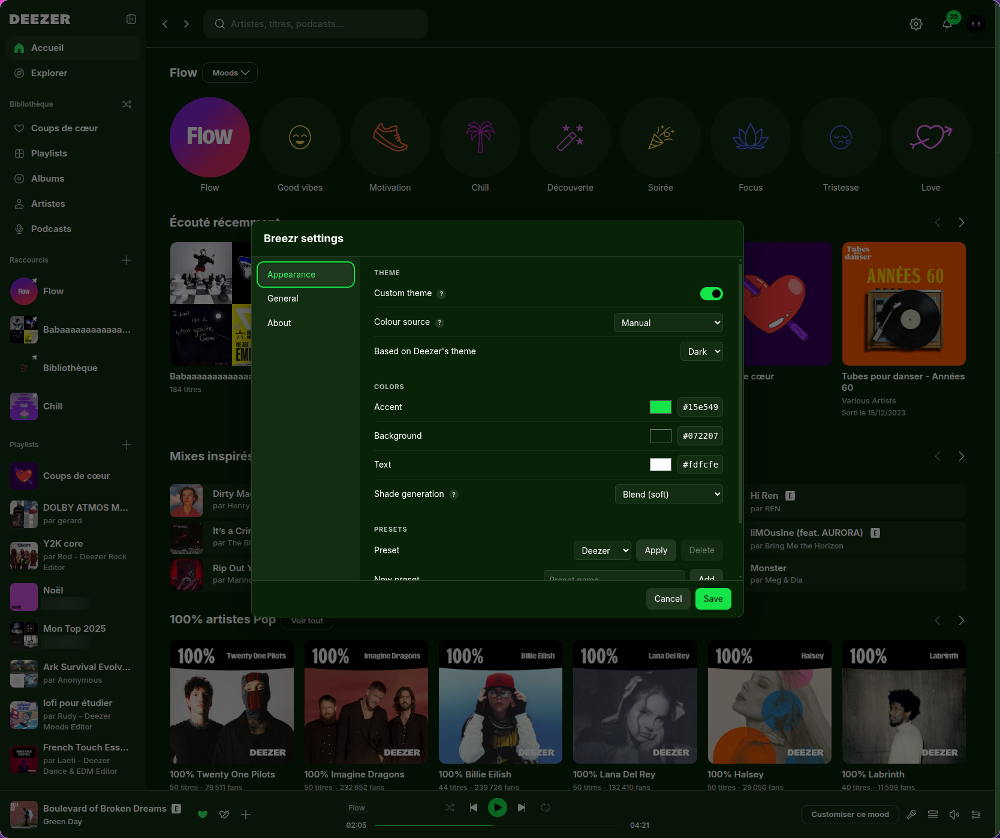
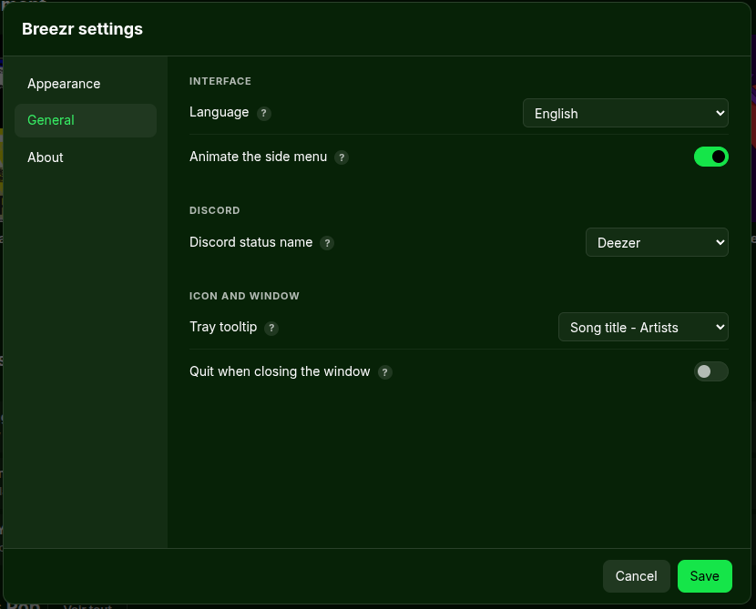
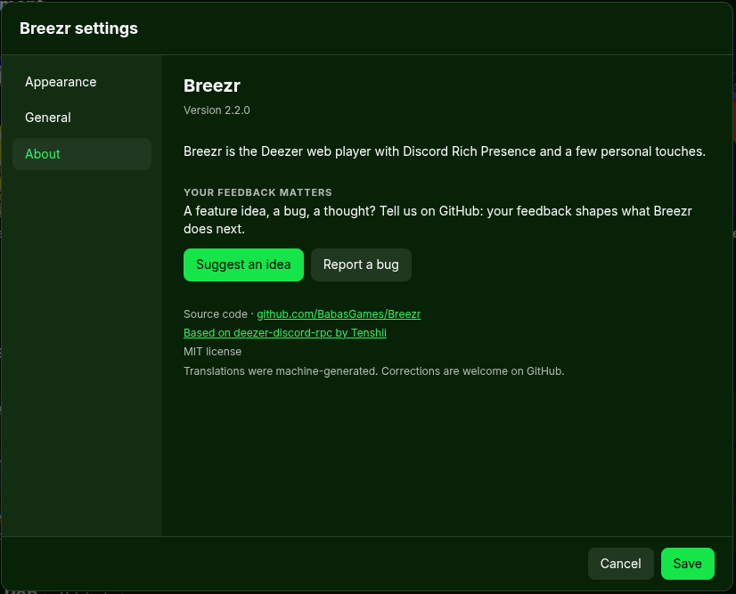

# Breezr

The real Deezer web player in a desktop window, **vanilla+**: Discord Rich Presence
plus a few personal touches the official app doesn't offer, starting with fully
custom colors.

Breezr is a hard fork of [deezer-discord-rpc](https://github.com/CuteTenshii/deezer-discord-rpc)
by Tenshii (MIT). It installs side by side with it and keeps its own settings.



## Download

Grab the latest version from the [releases page](https://github.com/BabasGames/Breezr/releases/latest):

- **Windows**: `Breezr-win-x64.exe`
- **macOS**: `Breezr-mac-arm64.dmg` (Apple Silicon) or `Breezr-mac-x64.dmg` (Intel)
- **Linux**: `.deb`, `.rpm`, `.snap` or `.AppImage`

The installers aren't signed yet, so Windows and macOS will show a warning the first time.
Breezr tells you when a new version is out.

## Features

- Discord Rich Presence for tracks, albums, podcasts and radios
- Custom theme: pick an accent, background and text color, everything else is derived;
  an Advanced mode lets you override any single color
- Colour sources (optional): follow your desktop's palette live — [Caelestia](https://github.com/caelestia-dots),
  any pywal-format `colors.json` (pywal, wallust, matugen…), or the system accent colour
- The left menu slides when you fold it (can be turned off)
- Settings window (`Ctrl+,` / `Cmd+,`, tray menu, or the ⚙ button), with a "?" next to anything that needs explaining
- Available in 14 languages (follows Deezer's language by default)



<p>
  
  
</p>

## What's next

More is on the way, both looks and features. Got an idea, or found a bug?
[Suggest an idea](https://github.com/BabasGames/Breezr/issues/new?template=idea.yml) or
[report a bug](https://github.com/BabasGames/Breezr/issues/new?template=bug.yml),
it's what decides what comes next.

## Build

```bash
bun install
bun run run      # dev
bun run build    # installers in dist/
bun test
```

## Translations

Initial translations were machine-generated. Corrections from native speakers are
very welcome — edit `src/locales/<code>.json` and open a pull request.

## License

MIT — see [LICENSE](LICENSE).
